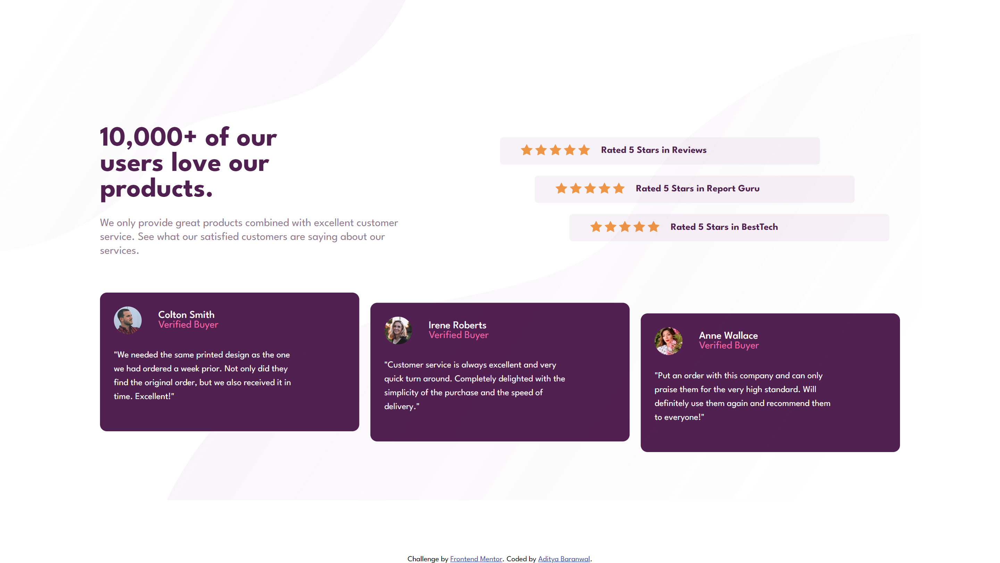

# Frontend Mentor - Social proof section solution

This is a solution to the [Social proof section challenge on Frontend Mentor](https://www.frontendmentor.io/challenges/social-proof-section-6e0qTv_bA). Frontend Mentor challenges help you improve your coding skills by building realistic projects. 

## Table of contents

- [Overview](#overview)
  - [The challenge](#the-challenge)
  - [Screenshot](#screenshot)
  - [Links](#links)
- [My process](#my-process)
  - [Built with](#built-with)
  - [What I learned](#what-i-learned)
  - [Continued development](#continued-development)
  - [Useful resources](#useful-resources)
- [Author](#author)
- [Acknowledgments](#acknowledgments)

## Overview

### The challenge

Users should be able to:

- View the optimal layout for the section depending on their device's screen size

### Screenshot

.png


- Solution URL: [get solution](https://github.com/CHARLIEADITYA/social-proof-section-master.git)
- Live Site URL: [view](https://charlieaditya.github.io/social-proof-section-master/)

## My process

### Built with

- Semantic HTML5 markup
- CSS custom properties
- Flexbox
- Mobile-first workflow
- [Styled Components](https://styled-components.com/) - For styles

### What I learned
here i learned how can we task done easily.

To see how you can add code snippets, see below:

```css
.rating::before {
    content: url('../assests/images/icon-star.svg') " " url('../assests/images/icon-star.svg') " " url('../assests/images/icon-star.svg') " " url('../assests/images/icon-star.svg') " " url('../assests/images/icon-star.svg');
}
````
## Author

- Github - [CHARLIEADITYA](https://github.com/CHARLIEADITYA)
- Frontend Mentor - [@CHARLIEADITYA](https://www.frontendmentor.io/profile/CHARLIEADITYA)
- Linkedin - [@adityabaranwal34](https://www.linkedin.com/in/adityabaranwal34/)

